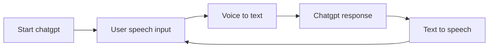

# TandemGPT

<svg xmlns="http://www.w3.org/2000/svg" viewBox="0 0 24 24" data-supported-dps="24x24" fill="currentColor" class="mercado-match" width="24" height="24" focusable="false">
  <path d="M20.5 2h-17A1.5 1.5 0 002 3.5v17A1.5 1.5 0 003.5 22h17a1.5 1.5 0 001.5-1.5v-17A1.5 1.5 0 0020.5 2zM8 19H5v-9h3zM6.5 8.25A1.75 1.75 0 118.3 6.5a1.78 1.78 0 01-1.8 1.75zM19 19h-3v-4.74c0-1.42-.6-1.93-1.38-1.93A1.74 1.74 0 0013 14.19a.66.66 0 000 .14V19h-3v-9h2.9v1.3a3.11 3.11 0 012.7-1.4c1.55 0 3.36.86 3.36 3.66z"></path>
</svg>
<https://www.linkedin.com/in/oscar-herrera-f/>

# Introduction

A code made in python to practice your speaking anytime using **chatgpt** as a language exchange partner.

## Features

- Use chatgpt web which is open to the general public.
- Bypass cloudflare bot detector.
- Talk and listen to chatgpt, read is not needed!.

## Requirements

- Open chatgpt in your browser normally before running the program. Just open it and close it, no need to interact with it.
- Windows only (for now)

## Installation

- Install Python 3.x (if it is not already installed)
- Install Selenium by running  `pip install selenium`
- Download a Chrome webdriver from the Selenium website ([http://www.seleniumhq.org/download/](http://www.seleniumhq.org/download/)) and add it to your PATH or just copy into repository folder

## Usage

- Clone or download this repository
- Navigate to the repository directory in a terminal
- Run the script by typing  `python process.py`

## Status

Chatgpt login bypass finished.
It can start conversation with keyboard input.
Missing detect when finished typing a response 

## Diagram

The general idea for the project is represented in the following flow chart.

