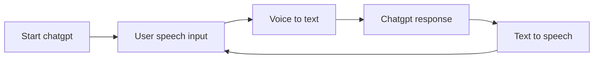

# TandemGPT

[Linkedin](https://www.linkedin.com/in/oscar-herrera-f/)

# Introduction

A code made in python to practice your speaking anytime using **chatgpt** as a language exchange partner.

## Features

- Use chatgpt API with latest release GPT-4.
- Talk and listen to chatgpt, read is not needed!.

## Requirements

- Openai API_KEY.
- Windows only (for now)

## Installation

- Install Python 3.x (if it is not already installed)
- Clone repository.

## Usage

- Navigate to the repository directory in a terminal.
- Run the script by typing  `python process.py`

## Status
Finished.
Webversion stoped for cloudflare bot detection.

## Diagram

The general idea for the project is represented in the following flow chart.

